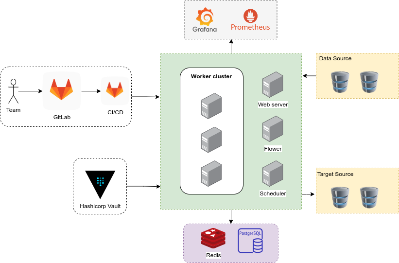
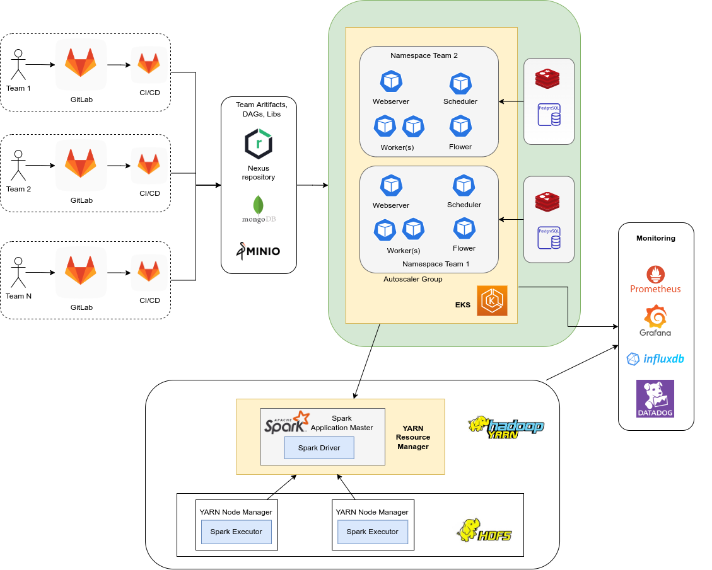
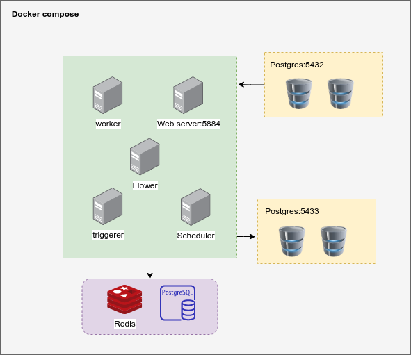

# Architecture

In this section, I use Hashicorp Vault as backend to store secrets and credentials.   

Grafana and Prometheus are for monitoring and notification. The metrics can be gauge, time series, it should be the 
number of success and failure DAGs, the percentile of DAG runtime, top 10 long-running DAGs, recent fail DAGs,...

**Note:** The architecture below here explains how we can do it, not implement it in this repository

## Small and medium table
When the size is not a big deal and the transformation on it is simple, straight-forward, we can use `PythonOperator` to
extract data from data sources, transform and write to target database using JDBC. 

Table can be indexed, partitioned and tuning like [system-design-primer#sql-tuning](https://github.com/donnemartin/system-design-primer#sql-tuning) 
to improve performance on read and write. Database can be scaled as well.

To accelerate the ETL job, table can be chunked by SQL queries and ETL tasks can be distributed to multiple worker over
a task queue (Celery with RabbitMQ)

    
## Large table
If the table size is large with complex transformations, the Airflow worker is not enough resources, Spark 
running over YARN cluster is recommended for dealing with it. 

With Spark, we can facilitate the distributed task and handle data skew.  

## The current implementation
